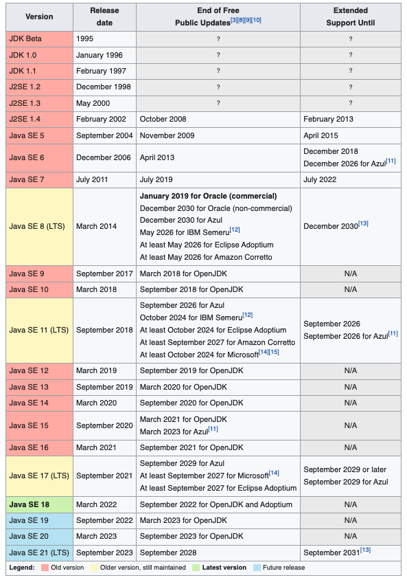

이번 장에서는 자바 버전에 따른 변경사항과 트렌드에 대해서 알아본다.
대부분 기계인간 John Grib과 Oracle 공식문서를 참고하여 작성하였으며 Java 7 이후 버전에 대한 정리만 진행한다.
주요 변경사항이라고 표시한 부분은 어디까지나 스프링 기반 백엔드 개발자인 필자의 개인적인 의견일 뿐~~(예를 들어Swing관련 큰 변화가 있어도 필자에게는 크게 느껴지지 않는다.)~~이며 보는 관점에 따라서 달라질 수 있다.

---

### 개요

필자가 재직 중인 회사에 새로운 프로젝트를 진행하게 되면서 자바의 버전을 선택해야하는 시간을 가지게 되었다.
지금까지 사용해왔고 편한 8, 11을 사용할 수는 있겠지만 요즘 자바와 코틀린이 빠르게 성장하며 자바의 버전도 빠르게 업데이트 되고 있기 때문에 버전별로 업데이트 된 사항들을 정리하는 시간을 가져보도록 한다.
이전과는 다르게 현시대의 자바 개발자들은 자바 버전에 관심을 가지고 개발을 해야한다. 아래의 이미지는 Wikipedia에 나와있는 자바 버전 이력이다.

주의깊게 봐야하는 부분은 **JDK Beta에서 Java SE 7까지 총 9개의 버전을 출시하는데 16년이라는 시간**이 걸렸다.
하지만 **Java SE 8(LTS)부터 Java SE 17(LTS)까지 총 10개의 버전을 출시하는데 이전의 절반도 안되는 7년이라는 시간**이 걸렸다.
밑에서 다루겠지만 Java 17이후 부터는 LTS 출시 간격을 3년에서 2년으로 줄인다는 발표까지 진행되었다.
(Oracle이 Sun을 2009년 쯤에 인수하고 처음으로 Java 7을 출시하였으니 이때를 시작으로 빠른 버전업이 진행되었다고 보는 것이 맞을 듯 하다.)
이렇게 빠르게 자바의 버전이 변경되며 새로운 문법과 새로운 GC 등등 새로운 기능들이 판을 치는 자바 생태계에 버전에 따른 변경사항을 공부하는 것은 어떻게 보면 당연하다.

여담이지만 이렇게 글을 정리하는 가장 큰 이유는 자바의 버전별 변경사항이 인터뷰 질문에 자주 등장하기 때문이다.
작성일 기준 1년 전쯤 "자바8에서 변경된 사항이 무엇인가요?" 라는 인터뷰 질문에 필자는 "Stream과 Optional이 추가되었습니다."라는 답변을 하였다.
답변을 들은 면접관은 "자바8에서 변경사항이 많이 있을텐데 다른 건 없나요???"라고 질문하였고 필자는 입을 다물 수 밖에 없었다.

이 글을 읽는 사람들은 필자와 같은 실수를 하지 않았으면 하는 바램으로 변경사항을 정리하며 인터뷰 질문에 대한 답변도 정리하는 시간을 가져보려 한다.
모든 변경사항을 다루지는 않으며 인터뷰 질문을 대비한 "주요 변경사항"과 JVM 관련 변경사항 및 기타 변경사항에 대해서 알아본다.

보안(Security)관련 업데이트는 내용이 너무 길어져서 추후 따로 정리하도록 한다. 

---

### [Java 8(LTS)](https://www.oracle.com/java/technologies/javase/8-whats-new.html)

#### 주요 변경사항

- [**Lambda Expressions**](https://docs.oracle.com/javase/specs/jls/se8/html/jls-15.html#jls-15.27): 
  메소드를 하나의 식으로 표현한 람다 표현식이 등장하였다. 익명 함수라고도 불리며 코드를 사용 이전보다 깔끔하게 만들어준다는 장점이 있다.
  특히 구현해야하는 메서드가 하나 뿐인 인터페이스를 구현하는 경우에 이전보다 훨씬 간략하게 코드를 작성할 수 있다.
- [**Functional Interface**](https://docs.oracle.com/javase/specs/jls/se8/html/jls-9.html#jls-9.8):
  구현해야하는 추상 메서드를 단 하나만 가지고 있는 인터페이스를 의미한다. 이러한 인터페이스를 람다 표현식과 함께 간편하게 사용할 수 있다.
- [**Interface Default Method**](https://docs.oracle.com/javase/specs/jls/se8/html/jls-13.html#d5e19889):
  추상 클래스와 같이 인터페이스에도 default 메서드가 추가되어 구현된 메서드를 가질 수 있다.
- [**Stream**](https://docs.oracle.com/javase/8/docs/api/java/util/stream/Stream.html):
  순차 및 병렬 집계 작업을 도와주는 Collections의 Stream 추가, 병렬 작업으로 다중 코어에서의 성능 향상
- [**Optional**](https://docs.oracle.com/javase/8/docs/api/java/util/Optional.html):
  NPE방지를 위한 새로운 타입의 Optional 클래스 추가
- [**DateTime Package**](https://www.javatpoint.com/java-date):
  java.time 경로에 Data-Time 패키지 추가

#### JVM 관련 변경사항

- AES(Advanced Encryption Standard) 내장 기능 추가
- PermGen 제거

#### 기타 변경사항

- [@Repeatable Annotation](https://www.javatpoint.com/java-8-type-annotations-and-repeating-annotations):
  중복되는 애노테이션 사용으로 인한 중복 코드를 제거하기 위해 @Repeatable 애노테이션 추가
- [Improved type inference](https://www.javatpoint.com/java-8-type-inference): 
  타입 추론 성능 향상 
- [Method parameter reflection](https://www.javatpoint.com/java-8-method-parameter-reflection): 
  메소드 또는 생성자의 매개변수 이름을 가져올 수 있는 기능 추가
- HashMap 성능 향상: 중복 키에 대한 성능 향상
- java.util.concurrent 개선: 새로운 인터페이스와 클래스 추가 및 람다 표현식 지원
- CompletableFuture-Future: 인터페이스에서 제공하는 기능 개선
- IO/NIO 개선: java.lang.String(byte[], *), java.lang.String.getBytes() 메서드 퍼포먼스 향상
- java.util 패키지에 Parallel Array Sorting 추가

#### 정리

Java8의 핵심 변경사항은 람다 표현식, Stream, Optional 정도가 될 듯하다.

JVM 메모리 구조에 대한 인터뷰 질문도 많이 나오는데 Java8에서 PermGen이 제거되었다는 것을 기억하고 PermGen에 대한 언급은 하지 않거나 언급하게 된다면 Java8에서 삭제되었다고 얘기해야한다.

Concurrent, Parallel, Stream, CompletableFuture 모두 다중 스레드를 염두한 동시처리 및 병렬처리와 관련이 있다. 
하드웨어 성능 향상으로 다중 코어 및 다중 스레드에 초점을 맞추어 Java도 발전하고 있는 것을 볼 수 있다.

**Java8 핵심 키워드: 람다 표현식, 함수형 인터페이스, DateTime, Concurrent, Parallel, Stream**

---

### [Java 9](https://docs.oracle.com/javase/9/whatsnew/toc.htm#JSNEW-GUID-C23AFD78-C777-460B-8ACE-58BE5EA681F6)

#### 주요 변경사항

- [**Modular Java Application Packaging**](http://openjdk.java.net/jeps/275):
  Project Jigsaw 기능을 통합하여 패키징 모듈화
- [**jlink**](https://docs.oracle.com/javase/9/tools/jlink.htm#JSWOR-GUID-CECAC52B-CFEE-46CB-8166-F17A8E9280E9):
  패키징 모듈화에 따른 jlink 추가
- [**Release Cadence**](https://blogs.oracle.com/java/post/update-and-faq-on-the-java-se-release-cadence):
  새로운 버전 발표 주기 변경
- [**Deprecated CMS**](http://openjdk.java.net/jeps/291): CMS GC Deprecated 처리
- [**New Default GC**](http://openjdk.java.net/jeps/248): G1GC를 기본 GC로 선정
- [**Private Interface Method**](http://openjdk.java.net/jeps/213): 인터페이스에 Private 메서드 사용가능
- [**Reactive Streams**](https://community.oracle.com/tech/developers/discussion/4418040/reactive-programming-with-jdk-9-flow-api):
  비동기 처리를 위한 반응형 프로그래밍 추가

#### JVM 관련 변경사항

- [Unified JVM Logging](http://openjdk.java.net/jeps/158): 통합 JVM 로깅, -Xloggc
- [Remove Deprecated GC Combinations](http://openjdk.java.net/jeps/214): Deprecated 되었던 GC 조합 제거

#### 기타 변경사항

- [jshell](http://openjdk.java.net/jeps/222): REPL(Read-Eval-Print Loop) 기능을 추가
- [HTML5 Javadoc](http://openjdk.java.net/jeps/224): JavaDoc -> HTML5 빌드기능 추가
- [try-with-resource 개선](https://bugs.openjdk.java.net/browse/JDK-7196163)
- [익명 메서드 <>연산자 추가](https://bugs.openjdk.java.net/browse/JDK-8062373)
- [Process API](http://openjdk.java.net/jeps/102): 프로세스 ID, 인수, 정보, 명령과 같은 정보를 반환하는 기능 추가.
- [CompletableFuture 개선](http://openjdk.java.net/jeps/266): 타임아웃과 지연 기능 추가

#### 정리

새로운 버전의 발표주기가 6개월로 변경되었다는 표현이 기존보다 짧은 주기로 업데이트가 이뤄진다는 의미처럼 보이지만 그렇지는 않다.
예를 들어 java8은 2014년 3월에 출시되었고 기능 릴리즈인 8u20은 2014년 8월에 출시되었다. 다음 릴리즈는 8u40으로 6개월 후에 출시되었다.
결국 기존에 6 ~ 8개월마다 기능 릴리즈가 있던 것을 6개월로 고정한다는 의미로 보면 될 듯하다.

CMS GC는 Deprecated되었고 기본 GC가 Parallel GC에서 G1GC로 변경되었다.
결국 자바는 메모리 단편화 문제를 해결하지 못한 CMS GC를 실패작으로 판단하고 G1GC를 표준으로 밀고 나가려는 것으로 보인다.
만약 인터뷰를 진행하려는 회사가 자바9 이상 버전을 쓰고 있다면 JVM 메모리 구조나 GC 과정에 대한 답변을 G1GC의 메커니즘에 맞춰야 한다.

이번에도 CompletableFuture가 개선되었으며 비동기 반응형 API인 Reactive Streams가 추가되었다.
본격적으로 자바도 비동기 프로그래밍의 시대를 열 것으로 예상된다.

공식문서에 따르면 Java9에서의 가장 큰 변화는 Java 프로그래밍 구성 요소인 모듈 추가라고 한다.
사실 이 부분에 대해서는 이해도 어렵고 분석하는데 시간이 많이 소요될 듯 하여 링크만 남겨두고 분석은 미루도록 한다.
[Java Platform Module System(JSR 376)](http://openjdk.java.net/projects/jigsaw/spec/)
[Module System(JEP 261)](http://openjdk.java.net/jeps/261)
[The Modular JDK(JEP 200)](https://openjdk.java.net/jeps/200)
[Modular Run-Time Images(JEP 220)](https://openjdk.java.net/jeps/220)
[Encapsulate Most Internal APIs(JEP 260)](https://openjdk.java.net/jeps/260)

**자바9 핵심 키워드: Reactive Streams CMS가 Deprecated, Default GC는 G1GC, 업데이트 주기 변경**

---

### [Java 10](https://www.oracle.com/java/technologies/javase/10-relnote-issues.html)

#### 주요 변경사항

- **Java9의 안정화 버전**
- [**Improvements for Docker**](https://bugs.openjdk.java.net/browse/JDK-8146115): 
  도커 컨테이너에서의 성능 향상, 추가된 flag들은 링크를 통해서 확인
- [**Local-Variable Type Inference**](https://openjdk.java.net/jeps/286):
  지역 변수 선언에 대한 var 타입 사용으로 유형 추론 가능.

#### JVM 관련 변경사항

- [Full GC 병렬처리](https://bugs.openjdk.java.net/browse/JDK-8172890): 
  G1의 Full GC를 병렬화하여 애플리케이션 지연 시간 단축
- [Unified Logging](https://bugs.openjdk.java.net/browse/JDK-8184286): 
  TraceYoungGenTime, TraceOldGenTime flag를 gc+heap+exit flag 하나로 통합

#### 기타 변경사항

- [Optional.orElseThrow() Method 추가](https://bugs.openjdk.java.net/browse/JDK-8140281)
- [Unmodifiable Collections 추가](https://bugs.openjdk.java.net/browse/JDK-8177290)
- [Class File Versioning 방식 변경](http://openjdk.java.net/jeps/322)

#### 정리

Java9의 안정화 버전이라서 그런지 이렇다할 변경사항은 보이지 않지만 도커 컨테이너에서의 성능 향상을 위한 플래그 추가는 만족스럽다.

기본 GC인 G1GC의 병렬 처리로 변경하였다. GC가 애플리케이션 스레드를 멈추지 않고 병렬로 처리되면 당연히 리소스 사용량이 높아질 수 밖에 없다.
혹시 [GC 작동 방식](https://imprint.tistory.com/35) 이 궁금하다면 링크로 이동하여 확인해본다.
필자가 이전에 작성한 [GC별 벤치마크 자료](https://imprint.tistory.com/51) 를 확인해보면 확실히 G1GC의 리소스 사용량이 높은 것을 확인할 수 있다.
하드웨어의 성능이 높아지는 추세이다보니 자바에서도 적은 리소스를 사용하는 것보다 할당된 리소스를 충분히 사용하여 빠르게 GC를 수행하는 방향으로 업데이트가 진행되는 것으로 보인다.

javascript와 같이 var 타입이 추가되었다. 
문서에 따르면 정확한 타입을 지정하는 것을 개발자들이 불편해하였고, C++, C#, Scala, Go는 이미 데이터 타입을 동적으로 지정하는 것이 가능했다고 얘기하고 있다.
컴파일러가 타입을 효과적으로 지정해주어 개발자들의 편의를 높여준다는 취지인데 이는 추후 업데이트 사항을 지켜보면서 쓸만한 기능인지 확인해봐야 할 듯하다.

Collections final 키워드를 사용해도 내용물이 바뀌는 것을 막을 수 없어서 불편하였는데 Unmodifiable 타입이 추가되어 컬렉션의 내용을 변경하지 못하는 것은 충분히 매력적인 기능이다. 

**자바10 핵심 키워드: var타입 추가**

---

### [Java 11](https://www.oracle.com/java/technologies/javase/11all-relnotes.html)
추가 참고: https://openjdk.java.net/projects/jdk/11/

#### 주요 변경사항

- **업데이트 주기 변경 이후 첫 LTS 버전**
- [**HTTP Client API표준화**](https://openjdk.java.net/jeps/321):
  Java9에 추가되었고 Java10에 업데이트 된 HTTP 클라이언트 API를 표준화.
- [**Local-Variable Syntax for Lambda Parameters**](https://openjdk.java.net/jeps/323):
  Java10에 추가된 var를 람다 표현식에서도 사용가능하도록 지원.

#### JVM 관련 변경사항

- [A No-Op Garbage Collector](https://openjdk.java.net/jeps/318):
  Garbage Collecting을 수행하지 않는 GC 출시. 더 이상 사용 가능한 Heap이 없는 경우 JVM 종료.
- [Low-Overhead Heap Profiling](https://openjdk.java.net/jeps/331):
  JVMTI를 통해 적은 오버헤드로 JVM의 힙 정보를 얻을 수 있는 방법 제공.
- [ZGC: A Scalable Low-Latency Garbage Collector](https://openjdk.java.net/jeps/333):
  신규 실험적(Experimental) GC인 ZGC 추가

#### 기타 변경사항

- [Release Doesn't Correctly Recognize Windows 11](https://bugs.openjdk.java.net/browse/JDK-8274840)
- [Release Doesn't Correctly Recognize Windows Server 2022](https://bugs.openjdk.java.net/browse/JDK-8273229)
- [Windows 2019 Core Server Is Not Supported](https://bugs.java.com/bugdatabase/view_bug.do?bug_id=JDK-8229800)
- [JDK time-zone data upgraded to tzdata2020c](https://mm.icann.org/pipermail/tz-announce/2020-October/000060.html)
- [US/Pacific-New Zone Name Removed as Part of tzdata2020b](https://mm.icann.org/pipermail/tz-announce/2020-October/000059.html)
- [Update Timezone Data to 2021c](https://bugs.openjdk.java.net/browse/JDK-8274407)
- [IANA Data 2020](https://www.oracle.com/java/technologies/tzdata-versions.html)
- [Localized Time Zone Name Inconsistency Between English and Other Locales](https://bugs.java.com/bugdatabase/view_bug.do?bug_id=JDK-8236548)
- Enhanced Support of Proxy Class: 역직렬화 제한 기능 추가(JDK-8236862)
- Better Serial Filter Handling: 직렬 필터 처리 성능 향상
- Better HTTP Redirection Support: HTTP Redirection 성능 향상
- Remove the Experimental AOT and JIT Compiler in OracleJDK 11u:
  [실험적 자바 기반의 JIT 컴파일러 제거](https://openjdk.java.net/jeps/317), [AOT(Ahead-of-Time) 컴파일러 제거](https://openjdk.java.net/jeps/295)
- [Turn off AOT by Default and Change Related Flags to Experimental](https://bugs.java.com/bugdatabase/view_bug.do?bug_id=JDK-8227439):
  AOT 컴파일러를 기본적으로 비활성화하고 flag를 통하여 실험적으로 사용 가능하도록 수정

#### 정리

var를 람다 표현식에서도 사용가능하다. 10버전에 이어 자바도 동적으로 타입이 지정되도록 업데이트 하는 것으로 보인다.

기존에 밀어주던 G1GC의 업데이트 사항은 없고 신규 실험적 GC인 ZGC가 출시되었다.

이번 업데이트에서 가장 많이 언급된 문구는 Date와 Window인 듯하다. (물론 중요한 부분은 아니지만)
Window PC와 Window 서버를 사용하지 않는다면 Window 관련 업데이트는 큰 신경을 쓰지 않아도 될 듯하다.
Date 관련 업데이트도 상당히 많이 있는데 개인적으로 모든 업데이트 사항을 확인할 필요까지는 없으며 Java8에서 추가된 DateTime 패키지를 사용하면 될 듯하다.

혹시라도 Java에서 시간관련 업데이트가 지속적으로 이루어지는 이유가 궁금하다면 [Naver D2 기술블로그(링크)](https://d2.naver.com/helloworld/645609) 에서 확인해보도록 한다.

**자바11 핵심 키워드: 람다에서 var사용 가능, ZGC 실험적 출시**

---

### [Java 12](https://www.oracle.com/java/technologies/javase/12all-relnotes.html)
추가 참고: https://openjdk.java.net/projects/jdk/12/

#### 주요 변경사항

- [**Switch Expressions(Preview)**](https://openjdk.java.net/jeps/325):
  Switch 문법 Kotlin과 유사하게 변경됨.

#### JVM 관련 변경사항

- [ZGC Concurrent Class Unloading](https://bugs.java.com/bugdatabase/view_bug.do?bug_id=JDK-8214897):
  사용하지 않는 클래스 언로드를 통한 애플리케이션 전체 공간을 낮추는 효과를 가져온다. 성능 향상
- [Allocation of Old Generation of Java Heap on Alternate Memory Devices](https://bugs.java.com/bugdatabase/view_bug.do?bug_id=JDK-8202286):
  G1, Parallel GC가 실험적 기능을 통해 NV-DIMM 메모리와 같은 대체 메모리 장치에 이전 세대의 Java Heap을 할당할 수 있다. 신규 OS 대응
- [G1 May Uncommit Memory During Marking Cycle](https://www.oracle.com/java/technologies/javase/12all-relnotes.html)
  G1이 Marking Cycle동안 사용하지 않는 메모리를 해제할 수 있도록 변경. 성능 향상 
- [Shenandoah: A Low-Pause-Time GC](https://openjdk.java.net/jeps/189):
  실험적 버전인 Shenandoah GC가 추가되었다.
- [JVM Constant API](https://openjdk.java.net/jeps/334):
  클래스 파일 및 런타임 아티팩트, 상수 풀을 조회할 수 있는 API 추가
- [Abortable Mixed Collections for G1](https://openjdk.java.net/jeps/344):
  설정한 최대 중지 시간을 초과하는 경우 G1이 혼합 컬렉션을 중단할 수 있도록 수정. 성능 향상

#### 기타 변경사항

- [Microbenchmark Suite](https://openjdk.java.net/jeps/230):
  효율적인 마이크로벤치마크를 위해 JDK에 새로운 제품군 추가.
- Better HTTP Redirection Support: HTTP Redirection 성능 향상
- [Default CDS Archives](https://openjdk.java.net/jeps/341)

#### 정리

우리가 체감할 수 있을 만한 변경사항은 Switch문의 변경이다. Kotlin과 비슷하게 변경되었다는 점이 주목할 만하다.

JVM 관련 업데이트가 상당히 많이 보인다. Java 11에서 ZGC가 추가된 것에 이어 다음 버전인 Java 12에서 새로운 GC인 Shenandoah GC가 실험적 버전으로 출시되었다.
G1성능 향상을 위한 업데이트가 세 개나 이루어졌다. Oracle에서 G1을 확실히 밀어주고 있는 것으로 보인다.
애플리케이션 스레드와 동기로 작동하는 Parallel GC의 성능 향상 업데이트도 이루어졌다. (동기 GC중 유일하게 Oracle에서 지속적으로 업데이트를 하는 것으로 보인다.)
이번 업데이트로 보아 G1의 차기 GC는 ZGC와 Shenandoah GC 중 하나가 될 가능성이 높아보이는데 추후 업데이트를 보면서 누가 이기는지 지속적으로 확인해보면 좋을 듯하다.

**자바12 핵심 키워드: Switch문법 변경, Shenandoah GC 실험적 출시**

---

### [Java 13](https://www.oracle.com/java/technologies/javase/13-relnote-issues.html#NewFeature)

#### 주요 변경사항

- [**Switch Expressions(Preview)**](https://www.oracle.com/java/technologies/javase/13-relnote-issues.html#NewFeature):
  break with value와 같이 사용하던 형식 제거. yield 추가.
- [**Text Blocks(Preview)**](https://openjdk.java.net/jeps/355):
  multiline 문자열을 위한 텍스트 블록 추가.

#### JVM 관련 변경사항

- [ZGC Uncommit Unused Memory](https://openjdk.java.net/jeps/351):
  ZGC가 사용하지 않는 메모리를 반납하도록 개선. 성능 향상
- [-XXSoftMaxHeapSize Flag](https://www.oracle.com/java/technologies/javase/13-relnote-issues.html#NewFeature):
  OOM의 발생을 피하기 위해 ZGC가 동적으로 늘리는 HeapSize를 제한
- [ZGC Maximum Heap Size Increased to 16TB](https://bugs.java.com/bugdatabase/view_bug.do?bug_id=JDK-8221786):
  ZGC의 최대 힙사이즈를 16TB로 상향 조절
- [Improvements in Serial GC Young pause time report](https://bugs.java.com/bugdatabase/view_bug.do?bug_id=JDK-8215221):
  혼동을 야기할 수 있는 로깅 메시지 변경. 성능 향상 X
- [Improve the Behavior of MaxRAM Settings and UseCompressedOops](https://bugs.java.com/bugdatabase/view_bug.do?bug_id=JDK-8222252):
  사용 가능한 메모리를 백분율 또는 비율로 계산하여 GC 힙 선택 플래그의 동작이 사용자의 기대에 부합하도록 개선.

#### 기타 변경사항

- [Dynamic CDS Archives](https://openjdk.java.net/jeps/350)
- [Removal of Old Features from javadoc Tool](https://bugs.java.com/bugdatabase/view_bug.do?bug_id=JDK-8215608):
  구버전 Javadoc 툴 제거
- [StringBuffer, StringBuilder Exception 구체화](https://bugs.java.com/bugdatabase/view_bug.do?bug_id=JDK-8218228):
  StringBuffer, StringBuilder의 길이를 음수로 하였을 때 발생하던 IndexOutOfBoundException을 NegativeArraySizeException으로 변경.

#### 정리

주요 변경사항은 12버전에 이어 Switch문이 개선되었다. 아직 Preview 버전인 것을 보아 다음 버전까지 지켜보아야한다.
multiline String을 위한 텍스트 블록이 드디어 추가되었다.
ZGC의 성능을 향상시키는 업데이트가 세 개나 진행되었다.

**Java13 핵심 키워드: ZGC의 지속적인 성능 향상**
(Switch Expression과 Text Blocks는 Preview 버전이기 때문에 핵심 키워드에서는 생략)

---

### [Java 14](https://www.oracle.com/java/technologies/javase/14all-relnotes.html)

#### 주요 변경사항

- [**Records(Preview)**](https://www.oracle.com/java/technologies/javase/14all-relnotes.html):
  신규 클래스인 Records 추가
- [**Thread Suspend/Resume Are Deprecated**](https://bugs.java.com/bugdatabase/view_bug.do?bug_id=JDK-8231602):
  Thread 일부 메서드 삭제를 위한 Deprecated 처리
- [**Detailed Message in NullPointerExceptions**](https://www.oracle.com/java/technologies/javase/14all-relnotes.html):
  -XX:+ShowCodeDetailsInExceptionMessages 플래그를 활성화하여 NPE가 발생하였을 때 getMessage()를 호출하여 상세 메시지 확인 가능.

#### JVM 관련 변경사항

- [ZGC on Windows](https://openjdk.java.net/jeps/365):
  ZGC를 Windows OS에서도 사용할 수 있도록 개선
- [ZGC on macOS](https://openjdk.java.net/jeps/364):
  ZGC를 macOS에서도 사용할 수 있도록 개선
- [Parallel GC Improvements](https://bugs.java.com/bugdatabase/view_bug.do?bug_id=JDK-8224666):
  Parallel GC도 예약 병렬 작업을 처리하기 위해 다른 GC와 동일한 메커니즘을 채택. 성능 향상
- [NUMA-Aware Memory Allocation for G1](https://openjdk.java.net/jeps/345):
  G1이 NUMA 노드에 객체를 할당하고 유지한다. 이는 Parallel GC와 유사하다. 성능 향상
- [Remove the CMS GC](https://openjdk.java.net/jeps/363):
  메모리 단편화 문제를 해결하지 못한 CMS가 결국 제거되었다.
- [Deprecate the ParallelScavenge + SerialOld GC Combination](https://openjdk.java.net/jeps/366)
- [Shenandoah self-fixing barriers](https://bugs.java.com/bugdatabase/view_bug.do?bug_id=JDK-8231087)
- [Epsilon warns about Xms/Xmx/AlwaysPreTouch configuration](https://www.oracle.com/java/technologies/javase/14all-relnotes.html):
  Epsilon GC(No-Op GC)에서 특정 플래그 설정시 warn 발생
- [Shenandoah asynchronous object/region pinning](https://bugs.java.com/bugdatabase/view_bug.do?bug_id=JDK-8232575):
  Get*Critical 메서드를 처리할 때 GCLocker 대신 객체/영역 고정하도록 변경. 병목 현상을 해결. 성능 향상
- [Shenandoah supports concurrent class unloading](https://bugs.java.com/bugdatabase/view_bug.do?bug_id=JDK-8226241):
  동시 클래스 언로딩 지원. 성능 향상
- [Shenandoah arraycopy improvements](https://www.oracle.com/java/technologies/javase/14all-relnotes.html):
  GC API 개선된 JDK 14에서 arraycopy 성능 향상.
- [Shenandoah supports JFR Leak Profiler](https://bugs.java.com/bugdatabase/view_bug.do?bug_id=JDK-8235685):
  JFR Leak Profiler를 통한 Memory Leak 분석 가능.
  

#### 기타 변경사항

- Better Listing of Arrays
- Improved Serialization Handling
- Turned Off AOT by Default and Changed Related Flags to Experimental

#### 정리

가장 큰 체감이 되는 부분은 Kotlin의 Data 클래스와 같은 역할을 하는 Records 클래스가 추가되었다는 점이다. (물론 아직은 Preview)
NPE 상세 메시지를 확인 가능하다는 점도 충분히 매력적인 업데이트처럼 보인다. 
(-XX:+ShowCodeDetailsInExceptionMessages의 기본값을 활성화로 해주면 좋았을텐데 비활성화가 기본값이다.)

JVM 관련 업데이트 사항이 매우 많다.

단편화 문제를 해결하지 못한 CMS가 결국 삭제되었다.
ZGC의 성능 향상은 없고 G1GC의 단 하나의 성능 향상 업데이트가 있었다.
Shenandoah GC의 경우 4개의 성능 향상과 1개의 Profiling을 위한 업데이트가 진행되었다.

CMS가 제거되면서 Concurrency하게 작동하는 GC는 G1이 유일해졌고 ZGC와 Shenandoah GC가 빠르게 업데이트 되고 있다.
ZGC와 Shenandoah GC의 경우 아직 Experimental 버전이지만 조만간 정식 버전으로 출시할 가능성이 높아보인다.

**자바14 핵심 키워드: CMS GC 제거, ZGC의 지원 범위 확대, Shenandoah GC 위주의 성능 향상**
(Records의 경우 Preview이기 때문에 핵심 키워드에서 생략)

---

### [Java 15](https://www.oracle.com/java/technologies/javase/15all-relnotes.html)

#### 주요 변경사항

- [**Text Blocks**](https://bugs.java.com/bugdatabase/view_bug.do?bug_id=JDK-8236934):
  Preview였던 Text Blocks 정식 출시

#### JVM 관련 변경사항

- [New Option Added to jcmd for Writing a gzipped Heap Dump](https://bugs.java.com/bugdatabase/view_bug.do?bug_id=JDK-8237354):
  Heap Dump를 생성할 때 gzip 압축을 활성화할 수 있는 옵션 제공
- [Obsolete -XXUseAdaptiveGCBoundary](https://bugs.java.com/bugdatabase/view_bug.do?bug_id=JDK-8228991):
  ParallelGC와 함께 사용하면 일부 응용프로그램에서 성능의 이점을 가질 수 있지만 여러 단점으로 비활성화되어 있던 옵션 제거.
- [Improved Ergonomics for G1 Heap Region Size](https://bugs.java.com/bugdatabase/view_bug.do?bug_id=JDK-8241670):
  기본 힙 영역 크기 계산이 기본적으로 더 큰 영역을 반환하도록 변경. 성능 향상.
- [ZGC A Scalable Low-Latency Garbage Collector(Production)](https://bugs.java.com/bugdatabase/view_bug.do?bug_id=JDK-8209683):
  ZGC가 정식 출시되었으며 더 이상 -XX:+UnlockExperimentalVMOptions 옵션 필요없이 사용 가능.

#### 기타 변경사항

- [Added isEmpty Default Method to CharSequence](https://bugs.java.com/bugdatabase/view_bug.do?bug_id=JDK-8215401):
  CharSequence에 isEmpty 메서드 추가
- [Hidden Classes](https://bugs.java.com/bugdatabase/view_bug.do?bug_id=JDK-8238358):
  Class::getName 메서드에 일반적인 이진 이름을 반환하지 않는 숨겨진 클래스 추가
- [Specialized Implementations of TreeMap Methods](https://bugs.java.com/bugdatabase/view_bug.do?bug_id=JDK-8227666):
  TreeMap 클래스에 putIfAbsent와 같은 신규 메서드 추가
- [Added Ability to Configure Third Port for Remote JMX](https://bugs.java.com/bugdatabase/view_bug.do?bug_id=JDK-8234484):
  속성을 설정하여 두 개의 포트를 통해 원격 네트워크 액세스 지원
- [New Option Added to jstatd for Specifying RMI Connector Port Number](https://bugs.java.com/bugdatabase/view_bug.do?bug_id=JDK-8196729):
  RMI 포트 번호 지정을 위한 jstatd의 새로운 옵션 추가
- [New Options Added to jhsdb for debugd Mode](https://bugs.java.com/bugdatabase/view_bug.do?bug_id=JDK-8196751):
  jhsdb 디버그 모드에 새로운 세 가지 옵션 추가
- [Flags Controlling C1 Inlining Have New Names](https://bugs.java.com/bugdatabase/view_bug.do?bug_id=JDK-8235673): 
  C1과 C2에서 동시에 사용하던 플래그가 분리되고 기존의 플래그는 C2에만 적용된다.
- [Pattern Matching for instanceof(Second Preview)](https://bugs.java.com/bugdatabase/view_bug.do?bug_id=JDK-8235186):
  Java 14에 이어 instanceof의 성능 향상 두 번째 Preview 버전이 출시.

#### 정리

Text Blocks가 정식 출시된 것 이외에 체감될 변경은 없다.
Experimental 버전에서 많은 업데이트가 이루어지던 ZGC가 드디어 정식으로 추가되었다.

**Java15 핵심 키워드: Text Blocks 문법의 정식 출시, ZGC 정식 출시, 모니터링 및 디버깅 기능 개선**

---

### [Java 16](https://www.oracle.com/java/technologies/javase/16all-relnotes.html)

#### 주요 변경사항

- [**Day Period Support Added to java.time Formats**](https://bugs.java.com/bugdatabase/view_bug.do?bug_id=JDK-8247781):
  java.time에 요일 형식을 지원하도록 수정
- [**Add Stream.toList() Method**](https://bugs.java.com/bugdatabase/view_bug.do?bug_id=JDK-8180352):
  Stream에 toList() 메서드가 추가되어 더 이상 Collectors.toList()와 같이 사용하지 않아도 된다.
- [**Records**](https://bugs.java.com/bugdatabase/view_bug.do?bug_id=JDK-8246771):
  Records가 정식적으로 Java언어에 추가되었다.
- [**Pattern Matching for instanceof**](https://bugs.java.com/bugdatabase/view_bug.do?bug_id=JDK-8250623):
  instanceof를 사용하는 경우 타입 캐스팅 없이 사용할 수 있도록 변경.

#### JVM 관련 변경사항

- [ZGC Concurrent Stack Processing](https://www.oracle.com/java/technologies/javase/16all-relnotes.html):
  ZGC가 Thread Stack을 safepoint에서 Concurrency 단계로 이동하여 Stop The World 시간없이 처리하도록 성능 향상.
- [Concurrently Uncommit Memory in G1](https://bugs.java.com/bugdatabase/view_bug.do?bug_id=JDK-8236926):
  OS에 메모리를 반납하고 힙을 축소하는 것은 많이 시간이 소요되는데 이러한 작업을 Concurrently하게 처리하여 성능 향상.

#### 기타 변경사항

- [Foreign Linker API (Incubator)](https://bugs.java.com/bugdatabase/view_bug.do?bug_id=JDK-8249755):
  C 또는 C++과 같이 다른 언어로 작성된 코드를 호출할 수 있는 기능 추가(Incubator 단계이며 기존의 NI를 대체한다.)
- [Strongly Encapsulate JDK Internals by Default](https://bugs.java.com/bugdatabase/view_bug.do?bug_id=JDK-8256299):
  타사 라이브러리, 프레임워크가 JDK의 내부 API 및 패키지를 사용하지 못하도록 캡슐화
- [Foreign-Memory Access API (Third Incubator)](https://bugs.java.com/bugdatabase/view_bug.do?bug_id=JDK-8253415):
  Java Heap 외부의 메모리에 액세스할 수 있는 API 세번째 Incubator 버전 출시
- [Vector API (Incubator)](https://bugs.java.com/bugdatabase/view_bug.do?bug_id=JDK-8201271):
  JEP는 개발자가 벡터 작업을 명시적으로 수행할 수 있또록 새로운 벡터 API를 도입
- [Warnings for Value-based Classes](https://bugs.java.com/bugdatabase/view_bug.do?bug_id=JDK-8249100):
  @ValueBased 애노테이션이 사용된 객체에 synchronized가 사용되는 경우 warning 메시지 발생
- [Sealed Classes(Second Preview)](https://bugs.java.com/bugdatabase/view_bug.do?bug_id=JDK-8246775):
  Java 15에 이어 봉인된 클래스 두번째 Preview 버전 출시.
- [Terminally Deprecated ThreadGroup stop, destroy, isDestroyed, setDaemon, isDaemon](https://bugs.java.com/bugdatabase/view_bug.do?bug_id=JDK-8256643):
  ThreadGroup 특정 메서드 Deprecated 처리

#### 정리

Records 클래스가 정식으로 자바 문법에 추가되었다.

확실한 경우 타입 캐스팅없이 객체를 사용할 수 있도록 Pattern Matching 기능이 추가되었다.
다른 언어로 작성된 코드를 호출할 수 있는 기능과 힙 메모리 외부의 메모리에 액세스 할 수 있는 기능이 지속적으로 개발되고 있다.
두 기능 모두 큰 변화처럼 안보일 수 있지만 비슷한 기능들이 Java16에 이어 Java17에도 업데이트가 진행된다.
자바에서 관심을 가지고 업데이트를 하는 만큼 우리도 관심을 가지고 지켜볼 필요가 있다.

Sealed Classes가 두번째 Preview 버전을 출시하였다.

**자바16 핵심 키워드: Records 클래스 출시, Pattern Matching**

---

### [Java 17](https://www.oracle.com/java/technologies/javase/17all-relnotes.html)

#### 주요 변경사항

- **Java11 이후 3년 만의 LTS 버전이며 최소 8년 동안 성능, 안정성 및 보안 업데이트가 예정되어 있는 버전.**
- [**OTN(Oracle Technology Network) 라이선스에서 NFTC(Oracle No-Fee Terms and Conditions)로 라이선스 변경**](https://www.oracle.com/java/technologies/javase/jdk-faqs.html)
- [**Sealed Classes**](https://bugs.openjdk.java.net/browse/JDK-8260514):
  Preview였던 Sealed 클래스와 인터페이스가 자바 언어에 추가.
- [**Pattern Matching for switch (Preview)**](https://bugs.openjdk.java.net/browse/JDK-8213076):
  switch문에서 인스턴스 타입으로 조건이 통과하는 경우 타입 캐스팅 없이 사용 가능.

#### JVM 변경 사항

- [ZGC: Fixed long Process Non-Strong References times](https://bugs.openjdk.java.net/browse/JDK-8277212):
  Non-Strong References에 대한 동시 프로세스 오류 수정. 성능 개선
- [Deprecate JVM TL Heap functions 1.0](https://bugs.openjdk.java.net/browse/JDK-8268241)
- [Parallel GC Enabled Adaptive Parallel Reference Processing by Default](https://bugs.openjdk.java.net/browse/JDK-8204686):
  Parallel GC가 GC에 사용할 스레드의 수 설정 로직 최적화

#### 기타 변경사항

- [Foreign Function & Memory API (Incubator)](https://bugs.openjdk.java.net/browse/JDK-8265033):
  Java16에서 JVM 외부 메모리에 접근 가능한 API가 3번째 Incubator 버전으로 출시하였다. 
  Java17 버전에서는 JVM 외부 함수와 메모리에 접근 가능한 API가 Incubator 버전으로 출시되었다. 
- [Experimental Compiler Blackholes Support](https://bugs.openjdk.java.net/browse/JDK-8259316):
  컴파일러 블랙홀에 대한 실험 지원이 추가.
- [New Class Hierarchy Analysis Implementation in the HotSpot JVM](https://bugs.openjdk.java.net/browse/JDK-8266074):
  JIT 컴파일러에 의한 인라인 결정을 개선하는 향샹된 처리기능을 제공.
- [Strongly Encapsulate JDK Internals](https://bugs.openjdk.java.net/browse/JDK-8266074):
  JDK의 대부분의 내부 요소를 강력하게 캡슐화.
- [Remove the Experimental AOT and JIT Compiler](https://bugs.openjdk.java.net/browse/JDK-8263327):
  실험적 AOT, JIT 컴파일러 제거
- [TreeMap.computeIfAbsent Mishandles Existing Entries Whose Values Are null](https://bugs.openjdk.java.net/browse/JDK-8259622):
  TreeMap의 computeIfAbsent 메서드가 null을 잘못처리하던 문제 해결

#### 정리

오라클에서 자바의 라이선스를 OTN에서 NFTC로 변경하였다.
NFTC(Oracle No-Fee Terms and Conditions)의 경우 OTN과 다르게 사용 용도 및 배포에 있어 제약 조건이 있던 OTN 라이선스와는 다르다.
상업 및 프로덕션 용도를 포함하여 모든 사용자들에게 무료로 사용 및 배포를 허용한다.

Sealed Classes가 정식적으로 자바 문법에 추가되었다.

Java16에 이어 switch 문에서 Pattern Matching을 통해 타입 캐스팅 없이 객체를 사용할 수 있도록 Preview 버전이 출시되었다.

**자바17 핵심 키워드: 라이선스의 변경, Sealed Classes, Pattern Matching**

---

### 간단 정리

지금까지 자바8에서 자바17까지 업데이트 사항에 대해서 알아보았다.
정리하고 보니 생각보다 너무 많은 양을 작성하게 된 듯하다.
평소에 잊지 않도록 주기적으로 정리하고 인터뷰 전에 주요 변경사항과 핵심 키워드 정도만 읽고 들어가도 충분할 듯 하다.

---

**참고자료**

- [람다의 개념 및 사용법](https://khj93.tistory.com/entry/JAVA-%EB%9E%8C%EB%8B%A4%EC%8B%9DRambda%EB%9E%80-%EB%AC%B4%EC%97%87%EC%9D%B4%EA%B3%A0-%EC%82%AC%EC%9A%A9%EB%B2%95)
- [Java8 함수형 인터페이스](https://bcp0109.tistory.com/313)
- [Java8 함수형 인터페이스 이해하기](https://codechacha.com/ko/java8-functional-interface/)
- [NUMA란?](https://wogh8732.tistory.com/399)
- [Shenandoah GC - 1](https://developers.redhat.com/blog/2020/03/04/shenandoah-gc-in-jdk-14-part-1-self-fixing-barriers#self_fixing_barriers)
- [Shenandoah GC - 2](https://developers.redhat.com/blog/2020/03/09/shenandoah-gc-in-jdk-14-part-2-concurrent-roots-and-class-unloading#)
- 

**용어정리**

- LTS(Long Term Support): 장기 지원 버전으로 일반적인 경우보다 장기간에 걸쳐 지원하도록 특별히 고안된 소프트웨어의 버전.