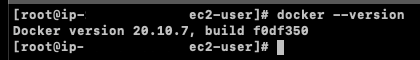
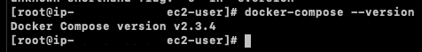
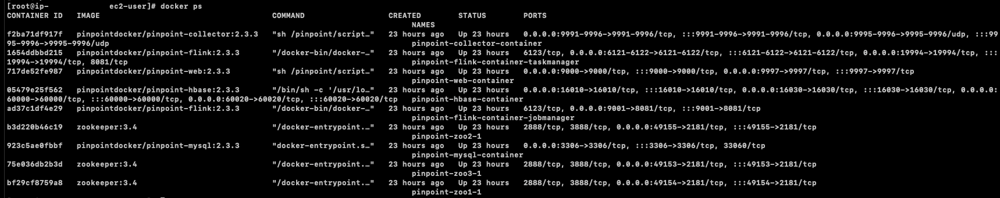
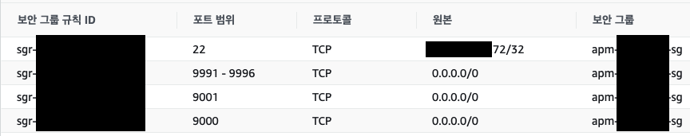
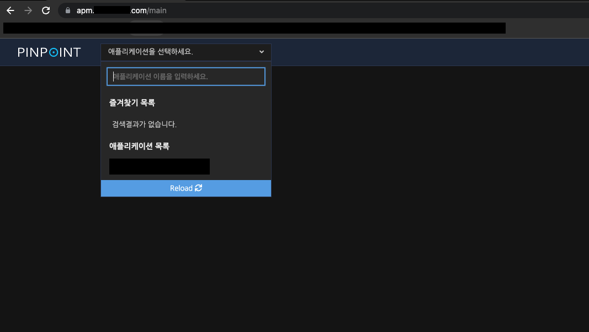
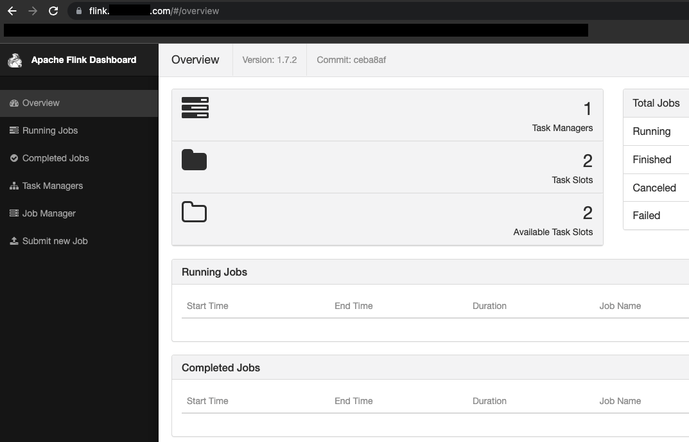

Optimization 카테고리에서는 성능 최적화가 필요하여 성능을 개선한 작업들을 기록한다.
같은 현상이 여러 번 발생할 수 있기 때문에 하나의 작업에는 같은 태그를 붙이기로 하였다.
아래와 같이 [ML-01] 태그가 붙어있는 글은 [ML-01]이라는 하나의 문제를 해결하기 위해 작성한 글이라고 생각하면 된다.
[ML-01] Memory Leak 분석, [ML-01] Pinpoint 설치, [ML-01] ...

---

### ML-01

ML-01을 해결하기 위해 APM 서버인 Pinpoint를 설치한다.

---

### Pinpoint 설치

Docker와 Docker Compose를 사용하여 설치할 것이며 EC2 Instance 생성 및 네트워크 구성에 대한 설명은 생략한다.

---

1. Docker 설치 ([공식문서 (링크)](https://docs.aws.amazon.com/ko_kr/AmazonECS/latest/developerguide/docker-basics.html))
   EC2 Instance(Linux)에 설치하는 방식으로 진행한다. 다른 플랫폼이나 OS를 사용하고 있다면 아래의 방법으로는 설치가 불가능하다.

    ```bash
    $ sudo yum update -y
    $ sudo amazon-linux-extras install docker
    $ sudo yum install docker
    $ sudo service docker start
    ```

   정상적으로 설치되었는지 확인하기 위해서 아래의 커맨드를 입력해본다.

    ```bash
    $ docker --version
    ```

   정상적으로 설치되었다면 아래와 같이 버전 정보가 출력될 것이다.

   

---

2. Docker Compose 설치

    ```bash
    $ sudo curl -L https://github.com/docker/compose/releases/latest/download/docker-compose-$(uname -s)-$(uname -m) -o /usr/local/bin/docker-compose
    $ sudo chmod +x /usr/local/bin/docker-compose
    $ sudo ln -s /usr/local/bin/docker-compose /usr/bin/docker-compose
    ```

   정상적으로 설치되었는지 확인하기  위해서 아래의 커맨드를 입력해본다.

    ```bash
    $ docker-compose -v
    ```

   정상적으로 설치되었다면 아래와 같이 버전 정보가 출력될 것이다.

   

---

3. Pinpoint 설치

   정석으로 설치하는 방식은 [Naver Pinpoint 공식 깃허브 페이지(링크)](https://github.com/pinpoint-apm/pinpoint-docker)에 접속해서 확인한다. 필자는 공식 페이지에서 다운받은 .env 파일과 docker-compose.yml 파일을 수정해서 진행할 것이다. 수정된 .env 파일과 docker-compose.yml 파일은 첨부 파일로 올려두었다.

   .env파일과 docker-compose.yml 파일을 서버로 업로드하고 아래의 커맨드를 입력하여 실행시킨다.

    ```bash
    $ docker-compose up -d
    ```

   이미지 파일을 다운로드 받아야하기 때문에 많은 시간이 소요될 것이다. 모든 작업이 완료되면 아래의 커맨드를 입력하여 정상적으로 실행되었는지 확인해본다.

    ``` bash
    $ docker ps
    ```

   아래의 이미지와 같이 나온다면 정상적으로 실행된 것이다.

   

---

4. 인바운드 규칙 수정

   AWS 인프라 구성은 다루지 않으려 하였으나 인바운드를 허용해야하는 포트 정도만 알아보고 넘어간다.

   

    - 22 Port: VPN을 통해서만 ssh 접속을 허용하기 위해서이다. Pinpoint 설정과는 무관하다.
    - 9991 ~ 9996 Port: Collector에서 사용하는 포트이며 Agent로 부터 메트릭을 받아오기위해 열어두어야 한다.
    - 9000 Port: Pinpoint web을 위해 필요하다.
    - 9001 Port: Pinpoint Flink를 위해 필요하다.

---

5. 정상 작동 확인

   3단계에서 프로젝트가 정상적으로 실행되었고 4단계에서 인바운드 규칙까지 설정되었다면 이제 접속이 가능할 것이다.
   Web과 Flink서버에 접속하여 정상작동하는지 확인해본다. (Route53에 도메인을 설정하고 인스턴스에 연결하는 방법에 대해서는 다루지 않는다.)

   Web에 접속하여 아래와 같은 화면이 나온다면 정상적으로 설치가 완료된 것이다.

   

   Flink에 접속하여 아래와 같은 화면이 나온다면 정상적으로 설치가 완료된 것이다.

   

---

### docker-compose.yml 에서 수정된 부분

1. Build하여 이미지를 생성하는 방식에서 공식 이미지를 다운받아 실행시키는 방식으로 변경
   pinpoint-hbase만 예로 들었으나 모든 서비스들을 같은 방식으로 수정하였다.

**공식 docker-compose.yml**
```yml
services:
  pinpoint-hbase:
    build:
      context: ./pinpoint-hbase/
      dockerfile: Dockerfile
      args:
        - PINPOINT_VERSION=${PINPOINT_VERSION}

    container_name: "${PINPOINT_HBASE_NAME}"
    image: "pinpointdocker/pinpoint-hbase:${PINPOINT_VERSION}"
    networks:
      - pinpoint

    volumes:
      - /home/pinpoint/hbase
      - /home/pinpoint/zookeeper
    expose:
      # HBase Master API port
      - "60000"
      # HBase Master Web UI
      - "16010"
      # Regionserver API port
      - "60020"
      # HBase Regionserver web UI
      - "16030"
    ports:
      - "60000:60000"
      - "16010:16010"
      - "60020:60020"
      - "16030:16030"
    restart: always
    depends_on:
      - zoo1
```

**수정된 docker-compose.yml**
```yml
services:
  pinpoint-hbase:
    container_name: "${HBASE_CONTANIER_NAME}"
    depends_on:
      - zoo1
    expose:
      - "60000" # HBase Master API port
      - "16010" # HBase Master Web UI
      - "60020" # Regionserver API port
      - "16030" # HBase Regionserver web UI
    hostname: "${HBASE_HOST_NAME}"
    image: "pinpointdocker/pinpoint-hbase:${PINPOINT_VERSION}"
    networks:
      - pinpoint
    ports:
      - "60000:60000"
      - "16010:16010"
      - "60020:60020"
      - "16030:16030"
    restart: always
    volumes:
      - /home/pinpoint/hbase
      - /home/pinpoint/zookeeper
```

2. APM 서버에 불필요한 서비스 삭제
   테스트용 프로젝트(pinpoint-quickstart)와 테스트용 프로젝트에서 메트릭을 뽑아내는 서비스(agent)는 APM서버를 구축하는데 불필요하여 삭제하였다. 삭제된 부분은 아래와 같다.

**공식 docker-compose.yml**

```yml
  pinpoint-quickstart:
    build:
      context: ./pinpoint-quickstart/
      dockerfile: Dockerfile

    container_name: "pinpoint-quickstart"
    image: "pinpointdocker/pinpoint-quickstart"
    ports:
      - "${APP_PORT:-8080}:8080"
    volumes:
      - data-volume:/pinpoint-agent
    environment:
      JAVA_OPTS: "-javaagent:/pinpoint-agent/pinpoint-bootstrap-${PINPOINT_VERSION}.jar -Dpinpoint.agentId=${AGENT_ID} -Dpinpoint.applicationName=${APP_NAME} -Dpinpoint.profiler.profiles.active=${SPRING_PROFILES}"
    networks:
      - pinpoint
    depends_on:
      - pinpoint-agent

  pinpoint-agent:
    build:
      context: ./pinpoint-agent/
      dockerfile: Dockerfile
      args:
        - PINPOINT_VERSION=${PINPOINT_VERSION}

    container_name: "${PINPOINT_AGENT_NAME}"
    image: "pinpointdocker/pinpoint-agent:${PINPOINT_VERSION}"

    restart: unless-stopped

    networks:
      - pinpoint
    volumes:
      - data-volume:/pinpoint-agent
    environment:
      - SPRING_PROFILES=${SPRING_PROFILES}
      - COLLECTOR_IP=${COLLECTOR_IP}
      - PROFILER_TRANSPORT_AGENT_COLLECTOR_PORT=${PROFILER_TRANSPORT_AGENT_COLLECTOR_PORT}
      - PROFILER_TRANSPORT_METADATA_COLLECTOR_PORT=${PROFILER_TRANSPORT_METADATA_COLLECTOR_PORT}
      - PROFILER_TRANSPORT_STAT_COLLECTOR_PORT=${PROFILER_TRANSPORT_STAT_COLLECTOR_PORT}
      - PROFILER_TRANSPORT_SPAN_COLLECTOR_PORT=${PROFILER_TRANSPORT_SPAN_COLLECTOR_PORT}
      - PROFILER_SAMPLING_RATE=${PROFILER_SAMPLING_RATE}
      - DEBUG_LEVEL=${AGENT_DEBUG_LEVEL}
      - PROFILER_TRANSPORT_MODULE=${PROFILER_TRANSPORT_MODULE}
    depends_on:
      - pinpoint-collector
```

**주의 사항**

필자가 올려둔 .env 파일을 살펴보면 PINPOINT_VERSION=2.3.3으로 적혀있다.
Pinpoint 공식 홈페이지에서 다운 받는 경우 버전이 올라갈 때마다 바뀐 버전이 적혀있는 .env파일이 업로드 될 것이지만 필자가 올려둔 .env파일은 변경되지 않는다. 첨부파일로 Pinpoint를 구축하는 경우 공식 페이지에서 최신버전을 확인하고 .env파일에 반영해야한다.

---

지금까지 도커와 도커 컴포즈를 설치하고 Pinpoint 서버를 구축하는 방법에 대해서 알아보았다.