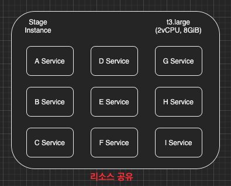

Optimization 카테고리에서는 성능 최적화가 필요하여 성능을 개선한 작업들을 기록한다.
같은 현상이 여러 번 발생할 수 있기 때문에 하나의 작업에는 같은 태그를 붙이기로 하였다.
아래와 같이 [ML-01] 태그가 붙어있는 글은 [ML-01]이라는 하나의 문제를 해결하기 위해 작성한 글이라고 생각하면 된다.
[ML-01] Memory Leak 분석, [ML-01] Pinpoint 설치, [ML-01] ...

---

### ML-01

필자가 재직중인 회사에 Stage 서버의 메모리 용량이 부족하여 여러 서비스가 모두 멈추는 현상(이하 ML-01)이 발견되었다.
이번 장에서는 인프라 담당자(이하 DevOps)의 관점보다는 백엔드 개발자(이하 개발자)의 관점에서 Memory Leak이 발생한 원인을 파악해본다.

---

### 개요

필자가 생각하기에 메모리 부족으로 서비스가 중단되었을 때 DevOps와 개발자는 해결하려는 방식이 다를 것이라고 생각한다. **DevOps**는 왜 메모리가 부족해서 서비스가 중단될 때까지 서비스가 Auto-Scaling이 되지 않았는가? 아니면 현재 Auto-Scaling되는 조건이 잘못된 것인가? 라는 관점에서 생각할 것이다. **개발자**는 내가 작성한 코드에서 메모리가 회수되지 않는 코드가 있는 것인가? 라는 관점에서 생각할 것이다. (물론 DevOps와 개발을 동시에 하는 필자의 의견일 뿐 전문 DevOps와 전문 개발자들의 의견은 다를 수 있다.) 이번에는 개발자의 관점에서 어떠한 이유로 평범하던 리소스 사용량이 치솟았는지 알아보도록 한다.

---

### 현재

현재 아래의 이미지와 같이 메모리가 8GB밖에 되지 않는 EC2 인스턴스에 수많은 서비스들이 리소스 사용 제약없이 실행되고 있으니 당연히 발생할 수 밖에 없는 문제이다.

**AS-IS**

근본적인 문제를 해결하려면 각각의 서비스를 서로 다른 사양 낮은 인스턴스로 분리하여 서비스들 간에 리소스가 공유되지 않도록 해야한다. 하지만 이번에는 개발자의 관점에서 살펴볼 것이므로 인프라를 개선은 없다. 
(DevOps의 관점에서 TO-BE로 변경해야하는 이유는 나중에 따로 정리해서 올리도록 하겠다.)

**TO-BE**

---

### 해결방법

1. EC2 인스턴스의 사양을 높여서 메모리를 16GB로 증설한다. (단순 Scale-Up이므로 인프라 개선은 없다.)
2. 사용 빈도가 높은 Admin 서비스의 경우 Heap 사이즈를 높게 설정하여 충분한 메모리를 할당받게 한다.
3. 사용빈도가 낮은 Partner, Chauffeur, Rider의 Heap 사이즈를 줄일 것이다.

---

### 해결방법만 진행하려 하였으나...

리소스를 분석하던 중 특정 시점에 리소스 사용률이 치솟는 현상이 발견되었다.

이렇게 특정 시점에 리소스 사용량이 치솟고 다시 떨어지지 않는다면 단순 Scale-Up을 하여도 언젠가는 Scale-Up된 리소스도 모두 소비하게 될 것이다. 개발자의 관점에서 정확히 문제가 발생한 이유를 찾아서 해결해보도록 한다.

필자가 생각하는 방법은 아래와 같다.

1. APM 연동 (Pinpoint 서버 연동, 어플리케이션의 JVM 및 리소스 사용량을 모니터링하며 트랜잭션 단위로 분석)
2. 서버 리소스 분석 (nmonchart 사용, 어플리케이션 단위가 아닌 서버 단위의 리소스 사용량을 모니터링)
3. JVM 분석 (GC Log와 HeapDump를 분석)