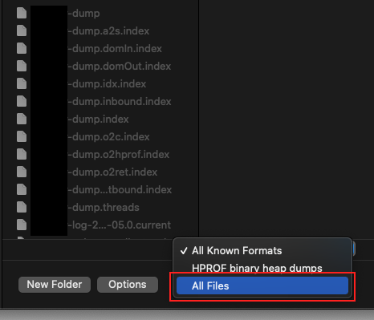

Optimization 카테고리에서는 성능 최적화가 필요하여 성능을 개선한 작업들을 기록한다.
같은 현상이 여러 번 발생할 수 있기 때문에 하나의 작업에는 같은 태그를 붙이기로 하였다.
아래와 같이 [ML-01] 태그가 붙어있는 글은 [ML-01]이라는 하나의 문제를 해결하기 위해 작성한 글이라고 생각하면 된다.
[ML-01] Memory Leak 분석, [ML-01] Pinpoint 설치, [ML-01] ...

---

### ML-01

ML-01을 해결하기 위해 GC Log와 HeapDump 파일을 생성하도록 톰캣 설정을 수정해본다.
생성된 GC Log와 HeapDump 파일이 정상적으로 생성되었는지 확인하는 과정까지 포함한다.

---

이번 장에서는 GC Log와 HeaDump 분석을 위하여 톰캣 설정을 남기도록 설정을 수정한다.

---

### 톰캣 설정 수정

/{톰캣 설치 경로}/bin 디렉토리로 이동한다.
에디터로 setenv.sh 파일을 열어서 아래의 내용을 추가한다.

```bash
export AGENT_PATH="/usr/local/pinpoint-agent-2.3.3"
export CATALINA_OPTS="$CATALINA_OPTS
                -javaagent:$AGENT_PATH/pinpoint-bootstrap.jar
                -Dpinpoint.agentId=admin-stage
                -Dpinpoint.applicationName=admin-stage
                -verbose:gc
                -XX:+PrintGCDetails
                -XX:+PrintGCTimeStamps
                -XX:+PrintGCDateStamps
                -XX:+PrintHeapAtGC
                -Xloggc:/root/jvm/log/admin/admin-log-%t
                -XX:+UseGCLogFileRotation
                -XX:GCLogFileSize=10m
                -XX:NumberOfGCLogFiles=3600
                -XX:+HeapDumpAfterFullGC
                -XX:+HeapDumpBeforeFullGC
                -XX:+HeapDumpOnOutOfMemoryError
                -XX:HeapDumpPath=/root/jvm/dump/admin/admin-dump"
```

-Dpinpoint.applicationName=admin-stage까지는 Pinpoint를 위한 설정이고 하단부는 전부 GC Log와 Heap dump를 생성하기 위한 설정이다.

**-verbose:gc**: GC가 수행될 때 로그를 남긴다.

**XX:+PrintGCDetails**: GC가 수행될 때 더 자세한 정보를 출력한다.

**XX:+PrintGCTimeStamps**: JVM 시작 시간을 기준으로 GC가 발생한 시간을 출력한다.

**XX:+PrintGCDateStamps**: 실제로 GC가 발생한 시간을 출력한다.

**XX:+PrintHeapAtGC**: GC 전후 메모리 사용량 변화를 자세하게 출력한다.

**Xloggc:{경로}**: GC Log가 저장될 경로와 파일명 규칙을 지정한다.

**XX:+UseGCLogFileRotation**: GC Log 로테이트 옵션을 활성화한다.

**XX:GCLogFileSize**: GC Log의 최대 사이즈를 지정한다.

**XX:NumberOfGCLogFiles**: 최대로 유지되는 GC Log 파일의 갯수를 지정한다.

**XX:+HeapDumpAfterFullGC**: FullGC 이후의 Heap 메모리 상태를 덤프 파일로 만든다.

**XX:+HeapDumpBeforeFullGC**: FullGC 직전의 Heap 메모리 상태를 덤프 파일로 만든다.

**XX:+HeapDumpOnOutOfMemoryError**: OOM이 발생하였을 때의 Heap 메모리 상태를 덤프 파일로 만든다.

**XX:HeapDumpPath**: Heap 덤프 파일을 저장할 경로를 지정한다.

---

수정을 완료하였다면 톰캣을 재실행한다.
최초 톰캣을 실행시킬 때 Spring Framework의 많은 클래스들이 로드되어 GC가 많이 발생한다.

옵션이 정상적으로 적용되었다면 아래의 이미지와 같이 덤프 파일이 생성되고 있을 것이다. 프로젝트를 처음 실행할 때 많이 생성된다.


GC 로그파일 또한 정상적으로 생성되어야 한다.


---

### 파일 유효성 확인

GC Log와 Heap Dump 파일이 우리가 원하는 대로 생성되었는지 확인해본다.
파일이 유효한지 검사는 필자의 PC에서 진행하며 파일을 서버에서 PC로 옮기는 과정은 생략한다.

**GC Log**

1. gceasy 사이트에 접속하여 GC Log 파일을 선택하고 Analyze를 선택한다.


2. 결과 화면을 보고 누락된 정보는 없는지 확인해본다.


**Heap Dump**

필자의 경우 Eclipse Memory Analyzer(이하 mat)를 사용하였다.

1. mat를 실행시키고 Open a Heap Dump를 선택한다.


2. PC로 가져온 Heap Dump 파일을 선택한다.
   이 때 선택 가능 파일을 All Files로 변경하고 선택해야한다.



오류없이 아래와 같은 화면이 나온다면 정상적으로 Dump 파일이 생성된 것이다.


---

### 주의 사항

GC Log의 경우 10mb 파일이 최대 3600개 까지 쌓이도록 구성하였기 때문에 지속적으로 용량이 차서 스토리지가 가득차는 문제가 발생하지 않는다.
하지만 Heap Dump 파일의 경우 따로 지워주지 않으면 Full GC가 발생할 때마다 생성되기 때문에 따로 배치를 돌려서 주기적으로 지워주어야한다.
필자의 경우 아래의 매일 아래의 스크립트를 실행시켜 하루에 한 번씩 생성된지 하루가 넘은 Dump 파일들을 지워주도록 하였다.

```bash
#!/bin/sh

DUMP_PATHES=(
        "/root/jvm/dump/serviceA"
        "/root/jvm/dump/serviceB"
        "/root/jvm/dump/serviceC"
        "/root/jvm/dump/serviceD"
)

for (( path=0; path<${#DUMP_PATHES[@]}; path++ ))
do
        cd ${DUMP_PATHES[$path]}
        GARBAGE_DUMP_FILES=(`find . -cmin +$(( 60 * 24 ))`)
        for (( i=0; i<${#GARBAGE_DUMP_FILES[@]}; i++ ))
        do
            if [[ ${GARBAGE_DUMP_FILES[$i]} != "." ]]
            then
                rm ${GARBAGE_DUMP_FILES[$i]}
            fi
        done
done
```

---

지금까지 GC Log와 Heap Dump 파일을 생성하고 확인하는 방법에 대해서 알아보았다.