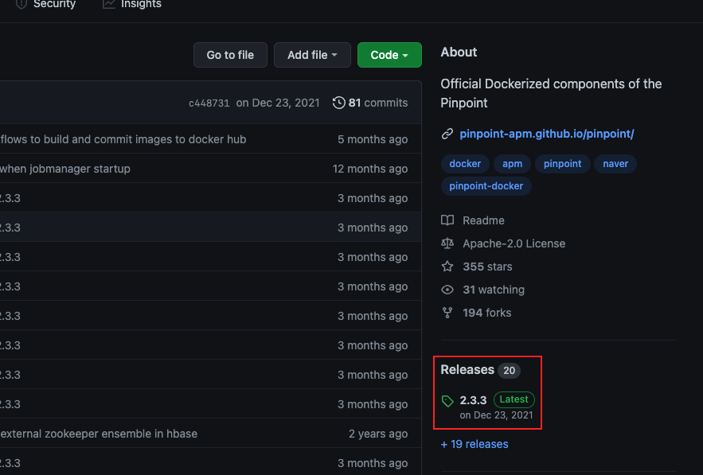

Optimization 카테고리에서는 성능 최적화가 필요하여 성능을 개선한 작업들을 기록한다.
같은 현상이 여러 번 발생할 수 있기 때문에 하나의 작업에는 같은 태그를 붙이기로 하였다.
아래와 같이 [ML-01] 태그가 붙어있는 글은 [ML-01]이라는 하나의 문제를 해결하기 위해 작성한 글이라고 생각하면 된다.
[ML-01] Memory Leak 분석, [ML-01] Pinpoint 설치, [ML-01] ...

---

### ML-01

ML-01을 해결하기 위해 우리의 애플리케이션에 Pinpoint Agent를 연동한다.

---

### Agent 연동

연동하는 어플리케이션 환경은 아래와 같다.

- SpringBoot + Embedded Tomcat + Docker (이하 부트 프로젝트)
- SpringFramework + Tomcat (이하 스프링 프로젝트)

---

### 부트 프로젝트 연동

어플리케이션을 실행시키기 위한 docker-compose.yml 파일을 보면서 연동에 필요한 부분들을 살펴본다.
services 블록에 pinpoint-agent를 실행시키기 위한 부분이 추가되어있다. 이 부분은 [공식 깃허브 페이지(링크)](https://github.com/pinpoint-apm/pinpoint-docker/blob/master/docker-compose.yml)의  pinpoint-agent 부분을 참고하여 작성하였다. 연동에 필요없는 부분은 생략하였다.


```yml
version: '3.6'

services:
 project-name:
  # Pinpoint Agent가 먼저 실행되고 우리의 어플리케이션이 실행되도록 추가
  depends_on:
   - pinpoint-agent 
  environment:
   JAVA_OPTS: >
    # Pinpoint Agent와 공유하는 볼륨에서 가져올 Agent jar파일 지정
    -javaagent:/pinpoint-agent/pinpoint-bootstrap-${PINPOINT_VERSION}.jar 
    # Pinpoint Web에서 보여질 에이전트의 ID
    -Dpinpoint.agentId=${AGENT_ID}
    # Pinpoint Web에서 보여질 어플리케이션 이름
    -Dpinpoint.applicationName=${APP_NAME}
    # Pinpoint의 프로필 (수정 X)
    -Dpinpoint.profiler.profiles.active=${AGENT_PROFILE}
  volumes:
   # Pinpoint Agent와 공유하는 데이터 볼륨 지정
   - data-volume:/pinpoint-agent 

 pinpoint-agent:
  container_name: '${AGENT_CONTAINER_NAME}'
  environment:
   - SPRING_PROFILES=${AGENT_PROFILE}
   - COLLECTOR_IP=${COLLECTOR_IP}
   - PROFILER_TRANSPORT_AGENT_COLLECTOR_PORT=${PROFILER_TRANSPORT_AGENT_COLLECTOR_PORT}
   - PROFILER_TRANSPORT_METADATA_COLLECTOR_PORT=${PROFILER_TRANSPORT_METADATA_COLLECTOR_PORT}
   - PROFILER_TRANSPORT_STAT_COLLECTOR_PORT=${PROFILER_TRANSPORT_STAT_COLLECTOR_PORT}
   - PROFILER_TRANSPORT_SPAN_COLLECTOR_PORT=${PROFILER_TRANSPORT_SPAN_COLLECTOR_PORT}
   - PROFILER_SAMPLING_RATE=${PROFILER_SAMPLING_RATE}
   - DEBUG_LEVEL=${AGENT_DEBUG_LEVEL}
   - PROFILER_TRANSPORT_MODULE=${PROFILER_TRANSPORT_MODULE}
  image: "pinpointdocker/pinpoint-agent:${PINPOINT_VERSION}"
  restart: always
  volumes:
   - data-volume:/pinpoint-agent

volumes:
 data-volume:
```

.env 파일은 아래와 같다.
COLLECTOR_IP 부분에 이전 장에서 Pinpoint 서버를 설치한 곳의 IP 주소를 적어야한다.
이전 장에서 Pinpoint 서버를 구성할 때 Port는 수정하지 않았기 때문에 Port는 수정할 필요가 없다.
또한 공식문서를 확인하고 최신 버전을 확인하고 PINPOINT_VERSION 부분을 수정해주어야 한다.



개인적으로 Agent는 무조건 최신 버전으로 설치하는 것 보다 Pinpoint의 서버와 버전을 맞추는 것이 서버와의 호환을 맞추는데 좋을 것으로 예상된다.

```env
### Agent
AGENT_CONTAINER_NAME=pinpoint-agent-container
AGENT_PROFILE=release
AGENT_DEBUG_LEVEL=INFO
# network module(GRPC,THRIFT)
PROFILER_TRANSPORT_MODULE=GRPC
# collector information required
COLLECTOR_IP={컬렉터가 실행되고 있는 서버의 IP}
PROFILER_TRANSPORT_AGENT_COLLECTOR_PORT=9991
PROFILER_TRANSPORT_METADATA_COLLECTOR_PORT=9991
PROFILER_TRANSPORT_STAT_COLLECTOR_PORT=9992
PROFILER_TRANSPORT_SPAN_COLLECTOR_PORT=9993
COLLECTOR_TCP_PORT=9994
COLLECTOR_STAT_PORT=9995
COLLECTOR_SPAN_PORT=9996
# Set sampling rate. If you set it to N, 1 out of N transaction will be sampled.
PROFILER_SAMPLING_RATE=1

### Common
PINPOINT_VERSION=2.3.3
```

이렇게 docker-compose.yml 파일과 .env 파일을 수정하고 컨테이너를 재실행하여 로그를 확인해본다.
정상적으로 설치가 완료되었다면 아래와 같이 Pinpoint Agent가 성공적으로 실행되었다고 표시될 것이다.


Pinpoint Web에 접속해보면 연동한 어플리케이션이 목록에 표시가 된다.


---

### 스프링 프로젝트 연동

1. Pinpoint Agent 설치
   모니터링 대상이 되는 어플리케이션이 설치되어 있는 인스턴스에 접속한다.
   압축파일이 저장될 적당한 위치에 접속하여 아래의 커맨드를 입력하여 Pinpoint Agent 파일을 다운로드 한다.
   이 때 버전 정보는 Pinpoint 서버의 버전과 맞게 수정해야한다. (버전이 달라도 작동하는 것은 확인하였으나 세부 호환을 위해 맞추는 것이 좋을 것으로 예상된다.)

    ```bash
    $ wget https://github.com/naver/pinpoint/releases/download/v2.3.3/pinpoint-agent-2.3.3.tar.gz
    ```

   다운로드가 완료되면 압축을 풀어주도록 한다.

    ```bash
    $ tar -zxvf pinpoint-agent-2.3.3.tar.gz
    ```

   총 세 개의 설정 파일을 변경해주어야한다.
   gRPC와 Thrift Configuration 부분의 IP 정보를 이전 장에서 Pinpoint 서버가 설치된 곳의 IP주소로 변경한다.

    - pinpoint-root.config
    - profiles/local/pinpoint.config
    - profiles/release/pinpoint.config

```yml
###########################################################
# gRPC Configuration                                      #
###########################################################
profiler.transport.grpc.collector.ip={컬렉터가 있는 서버의 IP}

# 중간 생략

###########################################################
# Thrift Configuration                                    #
###########################################################
profiler.collector.ip={컬렉터가 있는 서버의 IP}
```

2. Tomcat 설정 수정

   /tomcat 설치 경로/bin/setenv.sh에 아래의 내용을 추가한다.

```bash
# 1번 단계에서 Pinpoint Agent가 설치된 경로
export AGENT_PATH="/usr/local/pinpoint-agent-2.3.3"
export CATALINA_OPTS="$CATALINA_OPTS
                # 경로내의 jar파일 지정. 압축만 풀고 수정하지 않았다면 수정할 필요없다.
                -javaagent:$AGENT_PATH/pinpoint-bootstrap.jar
                # Pinpoint Web에서 표시되는 에이전트 아이디
                -Dpinpoint.agentId={Your Agent ID}
                # Pinpoint Web에서 표시되는 어플리케이션 이름
                -Dpinpoint.applicationName={Your Application Name}"
```

톰캣을 재실행시키면 Pinpoint Web에서 아래와 같이 정상적으로 확인될 것이다.


나머지 톰캣들도 같은 방식으로 설정하고 재실행하여 Pinpoint 서버와 연동하도록 한다.


  
---

지금까지 Pinpoint Agent 설정에 대해서 알아보았다.